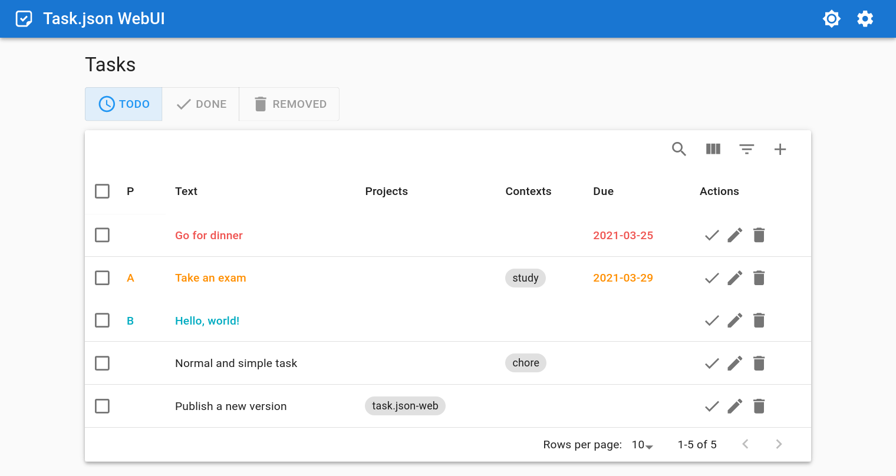
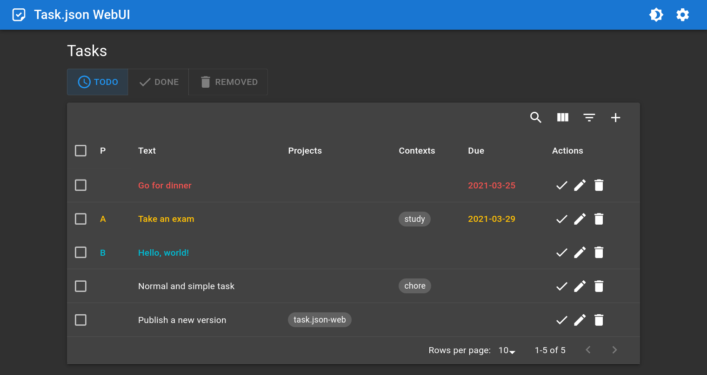

# task.json-web


Task management app with Web UI written in React.js based on [task.json](https://github.com/DCsunset/task.json) format.


## Screenshots






## Features

* Material Design UI
* Local storage for all data (no back-end server)
* Task synchronization with `task.json-server`
* Dark and light themes


## Online Demo

<https://task-json-web.vercel.app>

Note: the demo is a static page and the data will be stored in your browser's local storage.

## Self-hosted

Download the package in GitHub release.
Then run an HTTP server (e.g. Nginx, Caddy) to serve the files.


## Build

To manually build from source, clone this repository and run the following commands:

```
npm install
npm run build
```

The packed files can then be found in `build` directory.

## License

GPL-3.0
